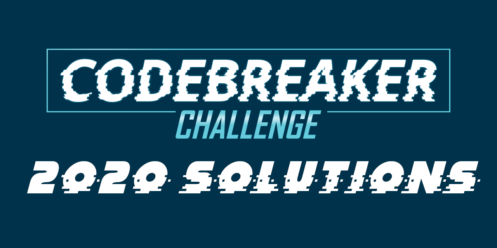

These are my solutions to the 2020 [NSA Codebreaker Challenge](https://codebreaker.ltsnet.net). This year they took a phased approach, releasing a second set of challenges about a month before the end of the competition. As the tasks ramp up in difficulty, the write-ups become less of a walkthrough and more of an explanation. I spent many hours on some of these problems and found it difficult to compress my process into something digestable. However, all of my code is available and you can ask any questions you might have in [this repo's Discussion page](https://github.com/luker983/nsa-codebreaker-2020/discussions). 

## Write-Ups

 
## *Phase 1*

| Task | Categories | Points |
|:---- |:---------- |:------ |
| [Task 1 - What's On the Drive?](phase1/task1/) |  |  |
| [Task 2 - Social Engineering](phase1/task2/) |  |  |
| [Task 3 - Social Engineering](phase1/task3/) |  |  |
| [Task 4 - Follow That Car!](phase1/task4/) |  |  |
| [Task 5 - Where Has the Drone Been?](phase1/task5/) |  |  |
| [Task 6 - Proof of Life](phase1/task6/) |  |  |

## *Phase 2*

| Task | Categories | Points |
|:---- |:---------- |:------ |
| [Task 7 - Plan for Rescue](phase2/task7/) |  |  |
| [Task 8 - Rescue & Escape (Part 1)](phase2/task8/) |  |  |
| [Task 9 - Rescue & Escape (Part 2)](phase2/task9/) |  |  |

## Overview

> The 2020 Codebreaker Challenge consists of a series of tasks that are worth a varying amount of points based upon their difficulty. This year, we are releasing the challenge in multiple phases.
>
> All Phase 1 tasks will become available immediately once the Challenge goes live and can be solved in any order, though there may be some dependencies between tasks. We will post updates about Phase 2 in the weeks to come.
>
> The point value associated with each task is based on relative difficulty and schools will be ranked according to the total number of points accumulated by their students. It is still recommended to solve tasks in order since the tasks flow with the storyline, but that is not a requirement. Solutions may be submitted at any time for the duration of the Challenge.

## Background 

> Two days ago, a renowned American journalist went missing while on assignment abroad. Although the city where the journalist was last seen has very few surveillance cameras on its streets, local authorities were able to provide us with some surveillance footage taken near the journalist's hotel during the days leading up to the disappearance. From the footage, we see that the journalist was kidnapped from the front of their hotel and taken away in an unmarked van. Unfortunately, we can also observe the kidnappers destroying the hostage's mobile phone making it impossible to track their route via GPS. Locals have also reported drone activity in the area leading up to the event. A criminal organization, well known for using drones in their kidnap-for-ransom schemes, has claimed responsibility for the incident.
>
> Your mission is to:
> 1. Locate the missing journalist and hostage takers' current position.
> 2. Facilitate the recovery of the journalist and take actions to prevent another incident from happening.
>
> Each task in this year's challenge will require a range of skills. We need you to call upon all of your technical expertise, your intuition, and your common sense to help us locate and rescue the journalist!
>
> Good luck. We hope you enjoy the challenge! 
