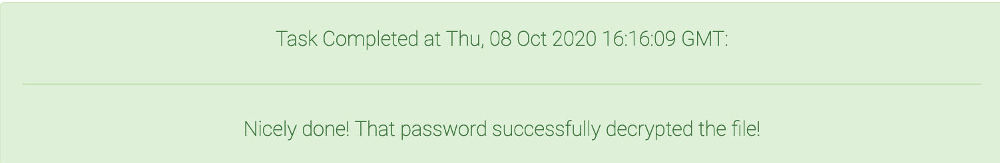

<div align="center">
    <a href="/phase1/task1"></a>
    <a href="/phase1/task3"></a>
</div>

<div align="center">

# Task 2 - Social Engineering

[](https://shields.io/)
[](https://shields.io/)
</div>

## Prompt

> The name of the encrypted file you found implies that it might contain credentials for the journalist's various applications and accounts. Your next task is to find information on the journalist's computer that will allow you to decrypt this file.
>
> Downloads:
> * [Archive of data from journalist's computer (for tasks 1 & 2) (home.zip)](https://codebreaker.ltsnet.net/files/task2/home.zip)
>
> Enter the password that decrypts the encrypted file. 
> ```
> ```

## Files

* [home.zip](/phase1/task1/home.zip) - Provided zip file
    - [home/](/phase1/task1/home/) - Unzipped home directory
* [solution.txt](/phase1/task2/solution.txt) - Task solution

## Solution

As a reference, here's the file tree we pulled from Task 1:

```
home
└── SkylerHummingbird324
    ├── Documents
    │   └── Blog-Articles
    │       ├── blogEntry1.txt
    │       ├── blogEntry2.txt
    │       └── blogIntro.txt
    ├── Downloads
    ├── Pictures
    │   ├── Pets
    │   │   ├── couchChillin.jpg
    │   │   ├── loaf.jpg
    │   │   └── shenanigans.jpg
    │   └── Travels
    │       ├── Malta
    │       │   ├── BlueGrotto.jpg
    │       │   ├── MostaDome.jpg
    │       │   └── TritonFountain.jpg
    │       └── Wales
    │           ├── heatherFields.jpg
    │           └── horseFeeding.jpg
    ├── keychain
    └── pwHints.txt

9 directories, 13 files
```

Using the same files, we need to figure out the user's password. The most obvious starting place is `home/SkylerHummingbird324/pwHints.txt`, which reads:

```
bank: anniversary + pet name
email: favorite band + favorite painter + sister's bday
house alarm: favorite dessert
keychain: pet name + pet bday
login: mom's bday + dad's nickname
music: first date + favorite dessert
work server: pet name + anniversary
blog: favorite color + pet name 
stepinator: color + petName + anniversary +fdate
``` 

We're looking for the keychain password, so we need the pet name and pet bday. Now we need to look through the pictures and blog posts to see if any of that information is provided directly or indirectly.

In `blogIntro.txt`, the author reveals the name of his cat:

> ...favorite furry little friend, and the best friend on the planet, **Bodie**. ...

Now we just need the birthday. In `Pictures/Pets/` there is a picture `shenanigans.jpg` that seems to be taken on Bodie's birthday, but the date isn't revealed in the image itself. 


We can look at the metadata to find a timestamp though:

```
$ exiftool shenanigans.jpg
...
Modify Date                     : 2019:02:21 13:00:34
Date/Time Original              : 2019:02:21 13:00:34
Create Date                     : 2019:02:21 13:00:34
...
``` 

Great! Now we know that Bodie's birthday is probably February 21st. But how do we know what format to put it in and what case to use for the name? This part requires a little bit of trial-and-error, but it shouldn't take too long to come up with the correct password.

You can guess using the Codebreaker website, but they limit submissions, so it's a better idea to use GPG directly:

```
gpg --pinentry-mode loopback --passphrase=p@$$w0rd --decrypt keychain
```

`Bodie0221` is the password that ends up working and this task is complete!

<div align="center">


</div>

<div align="center">
    <a href="/phase1/task1"></a>
    <a href="/phase1/task3"></a>
</div>

---
