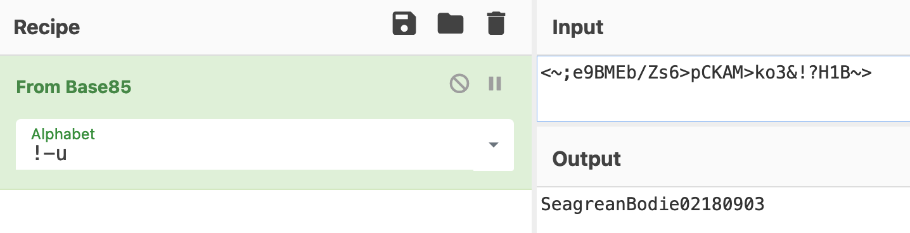

<div align="center">
    <a href="/phase1/task2"></a>
    <a href="/phase1/task4"></a>
</div>

<div align="center">

# Task 3 - Social Engineering

[](https://shields.io/)
[](https://shields.io/)
</div>

## Prompt

> Good news -- the decrypted key file includes the journalist's password for the Stepinator app. A Stepinator is a wearable fitness device that tracks the number of steps a user walks. Tell us the associated username and password for that account. We might be able to use data from that account to track the journalist's location! 
>
> Downloads:
> * [Archive of data from journalist's computer (for tasks 1 & 2) (home.zip)](https://codebreaker.ltsnet.net/files/task1/home.zip)
>
> Enter the username for the Stepinator account
> ```
> ```
>  
> Enter the password for the Stepinator account
> ```
> ```

## Files

* [home.zip](/phase1/task1/home.zip) - Provided zip file
    - [home/](/phase1/task1/home/) - Unzipped home directory
* [keychain](/phase1/task1/home/SkylerHummingbird324/keychain) - Encrypted keychain file
* [keychain.out](/phase1/task3/keychain.out) - Decrypted keychain file
* [solution.txt](/phase1/task3/solution.txt) - Task solution

## Solution

We can use the password we got in the last task to decrypt the keychain file:

```
gpg --pinentry-mode loopback --passphrase=Bodie0221 --decrypt keychain > keychain.out
```

To figure out what kind of file this is:

```
$ file keychain.out
keychain.out: SQLite 3.x database, last written using SQLite version 3027002
```

This is good. A SQLite database should be easy to dump and retrieve all of the passwords.

```
$ sqlite3 keychain.out
SQLite version 3.29.0 2019-07-10 17:32:03
Enter ".help" for usage hints.
sqlite> .dump
PRAGMA foreign_keys=OFF;
BEGIN TRANSACTION;
CREATE TABLE services(
								id integer PRIMARY KEY,
								service text NOT NULL,
								keyused integer,
								keyexpired integer);
INSERT INTO services VALUES(1,'email',1,0);
INSERT INTO services VALUES(2,'bank',1,0);
INSERT INTO services VALUES(3,'blog',1,0);
INSERT INTO services VALUES(4,'work server',1,0);
INSERT INTO services VALUES(5,'music',1,0);
INSERT INTO services VALUES(6,'login',1,0);
INSERT INTO services VALUES(7,'house alarm',1,0);
INSERT INTO services VALUES(8,'stepinator',1,0);
CREATE TABLE passwords(
								id integer PRIMARY KEY,
								service integer NOT NULL,
								username text,
								pwd text NOT NULL,
								valid integer NOT NULL,
								FOREIGN KEY (service) REFERENCES services (id));
INSERT INTO passwords VALUES(1,1,'Skyler_Hummingbird','<~6>q-q8P)WfDGY%W@<6L.0JkIB~>',1);
INSERT INTO passwords VALUES(2,2,'SHummingbird','<~0JY@B6>pCKAH~>',1);
INSERT INTO passwords VALUES(3,3,'Bodie-Skyler','<~;e9BMEb/Zs6>pCKAH~>',1);
INSERT INTO passwords VALUES(4,4,'SHummingbird0935','<~6>pCKAM>ko2u~>',1);
INSERT INTO passwords VALUES(5,5,'Skyler_Hummingbird','<~0KCgC6?7!gDJ<Y~>',1);
INSERT INTO passwords VALUES(6,6,'SkylerHummingbird324','<~0JkI=;eTT[CB~>',1);
INSERT INTO passwords VALUES(7,7,'224390935','<~6?7!gDJ<Y~>',1);
INSERT INTO passwords VALUES(8,8,'Bodie_Hummingbird_0221','<~;e9BMEb/Zs6>pCKAM>ko3&!?H1B~>',1);
COMMIT;
sqlite>
```

The database tells us that the Stepinator username is `Bodie_Hummingbird_0221`, but the password doesn't seem to be in a human readable format. My solution was to throw the text into [CyberChef](https://gchq.github.io/CyberChef/) and try a few decodings. I happened to get lucky and discover that the password is base85 encoded:

<div align="center">

 
</div>

The username is `Bodie_Hummingbird_0221` and the  password is `SeagreanBodie02180903` which completes this task.

<div align="center">


</div>

<div align="center">
    <a href="/phase1/task2"></a>
    <a href="/phase1/task4"></a>
</div>

---
