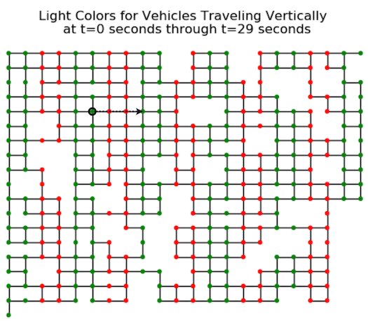
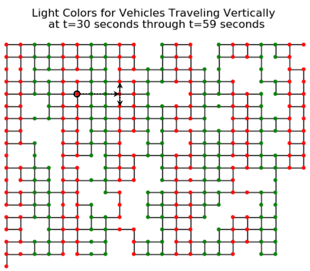
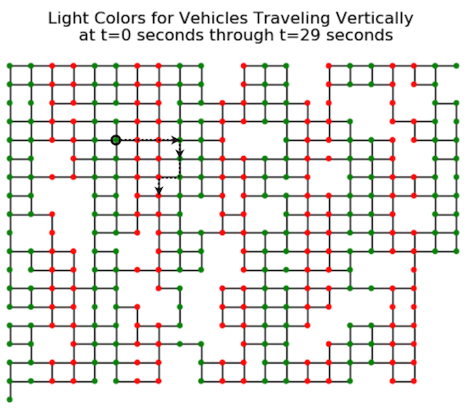
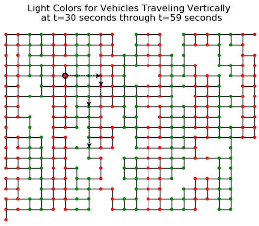
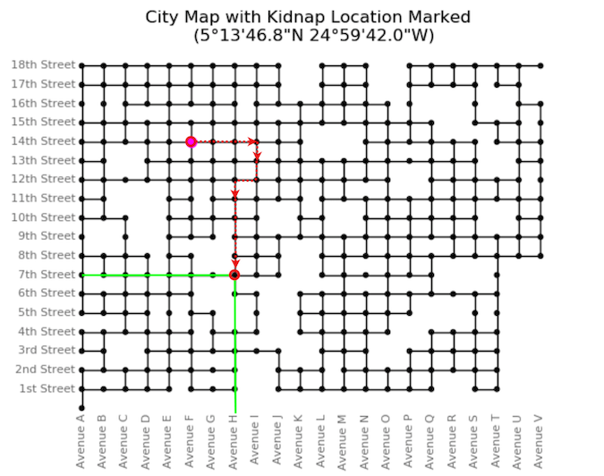

<div align="center">
    <a href="/phase1/task3"></a>
    <a href="/phase1/task5"></a>
</div>

<div align="center">

# Task 4 - Follow That Car! 

[](https://shields.io/)
[](https://shields.io/)
</div>

## Prompt

> By using the credentials in the decrypted file, we were able to download the journalist's accelerometer data from their Stepinator device from the time of the kidnapping. Local officials have provided us with a city map and traffic light schedule. Using these along with the journalist's accelerometer data, find the closest intersection to where the kidnappers took their hostage. 
>
> Downloads:
> * [Relevant information for solving the problem (README.txt)](https://codebreaker.ltsnet.net/files/task3/README.txt)
> * [Acceleration data (stepinator.json)](https://codebreaker.ltsnet.net/files/task3/stepinator.json)
> * [City map and traffic light schedule (maps.zip)](https://codebreaker.ltsnet.net/files/task3/maps.zip)
>
> Enter the avenue of the intersection. (ie. Avenue F & 3rd st, enter F)
> ```
> ```
>
> Enter the street of the intersection (ie. Avenue F & 3rd st, enter 3)
> ```
> ```

## Files

* [README.txt](/phase1/task4/README.txt) - Provided relevant information
* [stepinator.json](/phase1/task4/stepinator.json) - Provided acceleration data
* [maps.zip](/phase1/task4/maps.zip) - Provided city map and traffic light schedule
    - [maps/](/phase1/task4/maps/) - Unzipped maps directory
* [annotated_stepinator.json](/phase1/task4/annotated_stepinator.json) - Annotated acceleration data
* [solution.txt](./solution.txt) - Task solution

## Solution

Let's start by reading the extra information provided in `README.txt`. It provides a few crucial pieces of information:

1. The kidnappers start by driving East
2. We have accelerometer data for every second in m/s^2
3. Each city block is about 100m long
4. The speed limit was 13 m/s, right turns on red are not allowed, and traffic laws were followed
5. Look for slow-downs as a sign of turning
6. Traffic lights alternate every 30 seconds, light maps are provided

We should be able to figure out how many blocks are traveled and where some turns happen from looking at only the acceleration data, and then apply that to the map to narrow down the possible directions. Instead of breaking down the whole thing, I'll give an example of how I interpreted the acceleration data. Here are the first 30 seconds:

`[1.5, 1.5, 1.5, 1.5, 1.5, 1.5, 1.5, 1.5, 1.5, 0, 0, 0, 0, 0, 0, 0, 0, 0, 0, 0, 0, 0, 0, 0, -0.5, -3.375, -4.5, -4.5, -0.625, 0]`

At the start, there are 9 seconds of acceleration as the car gets up to the speed limit. Then there are 15 seconds of no acceleration, indicating that the car has reached the limit and is traveling at a constant speed. It then slows down to a full stop as it waits for a light to change. At this point, since the car is stopped, we have no idea if the car is going to go straight or turn left or right when the light changes to green.

To get the distance traveled, we need to know how to calculate distance from acceleration. the formula is `x = (v_final + v_initial) * time / 2`. Our equation looks like this: `(13 * 9 / 2) + (13 * 15) + (13 * 5 / 2) = 286`. About 3 city blocks have been traveled. Applying this method to the rest of the data, here's what I came up with:

<div align="center">

| Time Block | Movements |
| ---------- | --------- |
| 0-29s | 3 blocks, stop at light |
| 30-59s | 1 block, stop at light |
| 60-89s | 1 block, turn, 1 block, turn, 1 block, slow down for light |
| 90-119s | 4 blocks, stop |
</div>

It's possible for more turns to occur if the kidnappers turn after stopping at a light, so we need to keep that in mind when plotting all possible routes. Let's apply this data to the city map and the light cycles. `city_map.png` shows us that the starting location is 14th and F. We know that the kidnappers moved 3 blocks East and then stopped at a light. Does that line up with the charts we have?

| Light Map | Description |
| --------- | ----------- |
|  | The first two lights are red and the third light is green, but this graph shows the color of the *vertical* intersection, so imagine them opposite for the horizontal intersections that our car will be traveling through. The first two are green and the last is red, corroborating our prediction so far. |
|  | Moving on, we could turn left, right or continue straight. However, we know that we will only be able to proceed one more block before stopping again. Using the t30-59 light map, we see that the car must turn to run into a red light at the next intersection:
|  | This next time segment is interesting. We have to make many turns without hitting any red lights. Lucky for us, there's only one possibility that works! 
|  | Finally, we need to go 4 blocks without hitting any lights. South is the only viable path.

This should be our final destination!

<div align="center">


</div>

H Avenue and 7th is probably where the journalist was taken.

<div align="center">


</div>

<div align="center">
    <a href="/phase1/task3"></a>
    <a href="/phase1/task5"></a>
</div>

---

## References

* [Calculation of Distance from Acceleration - Richard Louie Chemistry Lectures](https://www.youtube.com/watch?v=F0TT2bY_9Lw)
