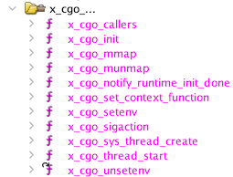
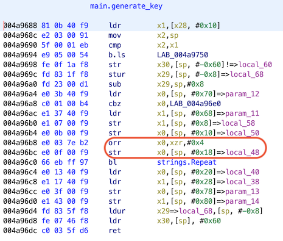
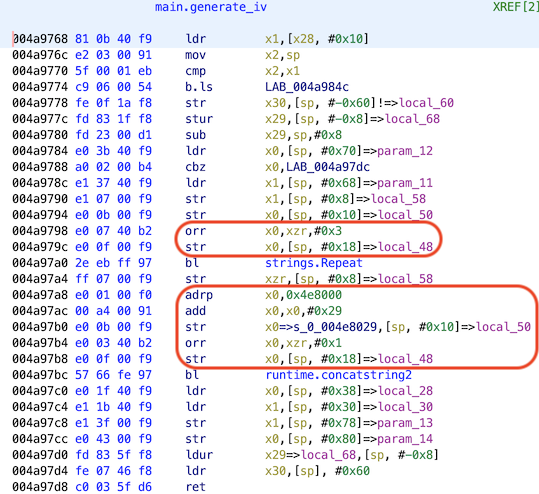
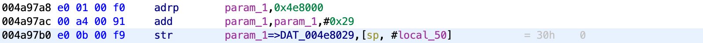
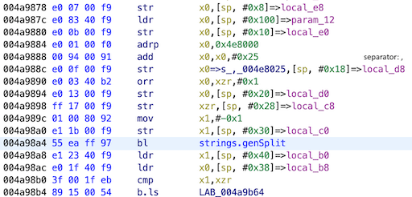
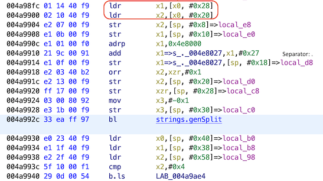
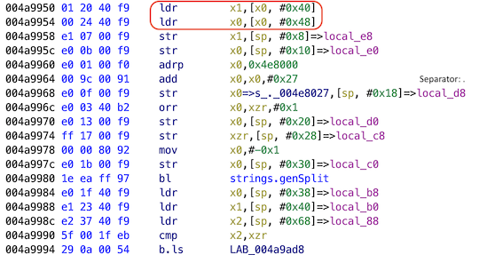

<div align="center">
    <a href="/phase1/task4"></a>
    <a href="/phase1/task6"></a>
</div>

<div align="center">

# Task 5 - Where Has the Drone Been?

[](https://shields.io/)
[](https://shields.io/)
</div>

## Prompt

> A rescue team was deployed to the criminal safehouse identified by your efforts. The team encountered resistance but was able to seize the location without causalities. Unfortunately, all of the kidnappers escaped and the hostage was not found. The team did find two important pieces of technology left behind: the journalist's Stepinator device, and a damaged surveillance drone. An analyst retrieved some encrypted logs as well as part of the drone's GPS software. Your goal for this task is to identify the location of the criminal organization's base of operations.
>
> Downloads:
> * [Interesting looking binary... (gpslogger)](https://codebreaker.ltsnet.net/files/task4/gpslogger)
> * [Recovered log files (logs.tgz)](https://codebreaker.ltsnet.net/files/task4/logs.tgz)
>
> Enter the approximate location of the organization's base in the format: ##°##'N ##°##'W
> ```
> ```

## Files

* [gpslogger](/phase1/task5/gpslogger) - Provided drone GPS logging binary
* [stepinator.json](/phase1/task5/logs.tz) - Provided log tarball
    - [Logs/](/phase1/task5/Logs/) - Untarred logs
* [brute_force.go](/phase1/task5/brute_force.go) - Log decrypter
* [solution.txt](./solution.txt) - Task solution

## Solution

It seems like we need to figure out some vulnerability in the encryption process (i.e., custom encryption, bad keys, ...). Normally I would start a reverse engineering challenge by running the binary and seeing what happens. But, this binary is compiled for the aarch64 architecture. I did spend some time trying to get this to run with QEMU, but eventually decided it wasn't worth the trouble and could be solved with static analysis only. (See Task 9 for dynamic debugging through QEMU).


After analyzing `gpslogger` in Ghidra, we can see a bunch of labels in the function menu that suggest this is a Go binary. This will be important later because Go is special and passes parameters on the stack instead of through registers, making it more difficult to reverse. For now though, let's find where the encryption of the logs happen to get a rough idea of what's going on, starting with `start_logging()`. These are the interesting calls:



* `poll_for_gga_rmc()`
    - `gps_GPSNMEA()`
    - `strings.genSplit()`
* `setup_cipher()`
    - `strings.genSplit()`
    - `strings.genSplit()`
    - `strings.genSplit()`
    - `generate_key()`
        - `strings.Repeat()`
    - `generate_iv()`
        - `strings.Repeat()`
        - `runtime.concatstring2()`
    - `aes.NewCipher()`
    - `cipher.NewCBCEncrypter()`
* `rmc_to_datetime()`
* ...

This makes the picture pretty clear. GGA and RMC are GPS-related messages, which makes sense in a GPS logger. Next, the cipher (presumably for the log encryption) gets constructed. A few strings are split and then a key and IV are created for an AES cipher. This likely rules out any custom encryption, but the keys are still fair game. String parsing and repeating is not a good sign when constructing a key. 

Now we need to start at the output of `generate_key()` and `generate_iv()` and work backwards to figure out how to recover them. 

<div align="center">


</div>

The `0x4` that gets loaded into `x0` and then stored in `sp+0x18`  before the `strings.Repeat()` is interesting. If a string is repeated four times, it could be brute-forceable! Is `generate_iv()` similar?

<div align="center">


</div>

It is! Except it only repeats a value three times and then concatenates some other string. the `0x1` is probably the size of the second string and the address is `0x4e8000 + 0x29` or `0x4e8029`, which points to the byte `0x30` or "0":

<div align="center">


</div>

This tells us the last byte of the IV as well as narrowing down the AES key size for us. Valid sizes in Go's crypto package are AES-128, AES-192, and AES-256. Because the key is 16 bytes long, we know that AES-128 is being used. Our key string must be 128 bits, divided by 4 is 32 bits, or **4 bytes long and repeated 4 times**. The 120 bits from the IV divided by 3 is 40 bits, or **5 bytes long and repeated 3 times, then concatenated with "0"**.

**NOTE:** From a practical standpoint, a GPS logger that encrypts logs would need some way of recovering those logs later. I got stuck on this for awhile assuming that the key would have to be static or derived from the filename. This was not the case, and I never figured out how the log would be recovered legitimately.

The next step is to trace back the strings that get repeated. Going back to `generate_key()`, [`strings.Repeat()`](https://golang.org/pkg/strings/#Repeat) takes in a string and a count. If the count is 4 and placed on the stack at `sp+0x18`, it's probably safe to assume that the string is passed in when registers `x1` and `x0` are stored at `sp+0x8` and `sp+0x10` respectively. Strings do not seem to be stored with a terminating symbol like they are in C, my best guess is that the `sp+0x8` is the string and `sp+0x10` is the size of the string. So, let's go back to `setup_cipher()` to see where those come from. 

`strings.genSplit()` gets called three times before hitting `generate_key()` and `generate_iv()`, so let's go up one more function to see what string(s) is(are) being split. Because `poll_for_gga_rmc()` gets called right before, it's safe to say that whatever string that function returns is what's being split in `setup_cipher()`. 

What exactly do `GGA` and `RMC` messages look like? [This document](https://navspark.mybigcommerce.com/content/NMEA_Format_v0.1.pdf) was incredibly useful in helping me to understand the format of these messages. A `GGA` message is of the following form: `$--GGA,hhmmss.ss,llll.lll,a,yyyyy.yyy,a,x,uu,v.v,w.w,M,x.x,M,,zzzz*hh` and `RMC` is of the form: `$--RMC,hhmmss.sss,llll.lll,a,yyyyy.yyy,a,x.x,u.u,xxxxxx,,,v*hh`. For more information about each symbol check out the link. 

We might be able to deduce what goes through `genSplit()` if we take a look at its arguments and assume that a `GGA` or `RMC` message is returned by the polling function. [`strings.genSplit()`](https://golang.org/src/strings/strings.go?s=5312:5365#L226) takes in a string, a separator, how many bytes of the separator to include in each substring, and the max number of substrings to save. It returns a string slice. From the first call in `setup_cipher()`, we can see that the call looks like this: `genSplit(mystery_string, ",", 0, -1)`. 

<div align="center">


</div>

Splitting on a comma makes sense if a `GGA` or `RMC` message is being parsed. The second and third calls to `genSplit` looks like this: `genSplit(mystery_string, ".", 0, -1)` as if two of the decimal separated values within the `GGA/RMC` message is being parsed.  

<div align="center">


</div>
<div align="center">


</div>

We can confirm this by seeing which member of the first `genSplit()` slice is fed to the second and third calls. The second call gets `x0+0x20` and `x0+0x28`. The third call gets `0x40` and `0x48`. Each string requires `0x10` of space for the pointer to the string and the size. So, the second call gets `slice[2]` and the third gets `slice[4]`. These correspond to the `llll.lll` and `yyyyy.yyy` fields in *both* `GGA` and `RMC` messsages. On top of that, on the left side of the decimal point, there are 4 `l`s and 5 `y`s, exactly what we need to generate the key/IV. Looking at the NMEA reference, we can see that the `l`s correspond to latitude and the `y`s correspond to longitude!

Now we know that the first 4 ascii digits make up the key and 5 ascii digits make up the IV, significantly reducing the keyspace. We can iterate over every possible value for key/IV (generating just like `gpslogger` does) until decryption is successful! How do we know if decryption is successful? Instead of trying to see what gets logged, I made the assumption that it would probably be ascii data, so if we decrypt something and it doesn't fall within that range (`8 < x < 127`) it probably isn't the correct key. That turned out to be enough to demonstrate that the GPS sentences were being logged. So I added a check to make sure the first decrypted character was `$` and printed out a few blocks if all of the checks were met. This worked, and it actually turns out that brute-forcing the IV isn't necessary. AES-CBC can decrypt everything except the first block without the IV. Because there is useful information beyond the first block, we can ignore it!

```
$ go run brute_force.go
Latitude Degrees (0-90): 0
Latitude Degrees (0-90): 1
Latitude Degrees (0-90): 2
Latitude Degrees (0-90): 3
Latitude Degrees (0-90): 4
Latitude Degrees (0-90): 5
5 38 $GLBGD,303525+05,0538.073024,N,02505.706995,W,1,12,0.7,57.0,M,-42.0,M,,*75
...
$GNRMC,153027.00,A,0538.073024,N,02505.706995,W,0.0,,280620,8.4,
```

Taking the degree/minute values from this `RMC` message gives us a flag of `05°38'N 25°05'W`

<div align="center">


</div>

<div align="center">
    <a href="/phase1/task4"></a>
    <a href="/phase1/task6"></a>
</div>

---

## References

* [NMEA Output Description - NavSpark](https://navspark.mybigcommerce.com/content/NMEA_Format_v0.1.pdf)
* [ARM64 version 2 page 1ARMv8 A64 Quick Reference - University of Washington](https://courses.cs.washington.edu/courses/cse469/18wi/Materials/arm64.pdf)
