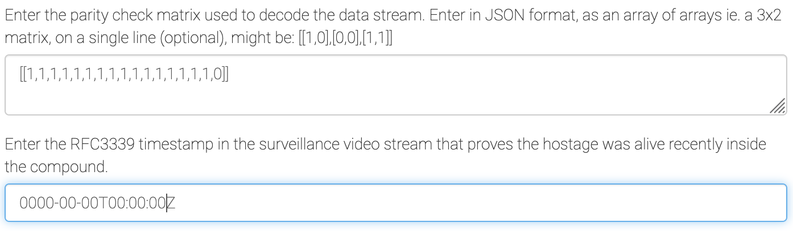
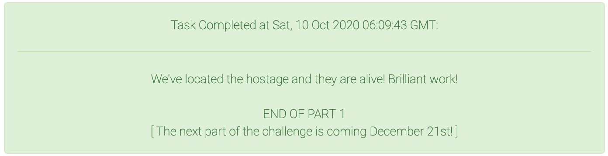

<div align="center">
    <a href="/phase1/task5"></a>
    <a href="/phase2/task7"></a>
</div>

<div align="center">

# Task 6 - Proof of Life

[](https://shields.io/)
[](https://shields.io/)
</div>

## Prompt

> Satellite imaging of the location you identified shows a camouflaged building within the jungle. The recon team spotted multiple armed individuals as well as drones being used for surveillance. Due to this heightened security presence, the team was unable to determine whether or not the journalist is being held inside the compound. Leadership is reluctant to raid the compound without proof that the journalist is there.
>
> The recon team has brought back a signal collected near the compound. They suspect it is a security camera video feed, likely encoded with a systematic Hamming code. The code may be extended and/or padded as well. We've used BPSK demodulation on the raw signal to generate a sequence of half precision floating point values. The floats are stored as IEEE 754 binary16 values in little-endian byte order within the attached file. Each float is a sample of the signal with 1 sample per encoded bit. You should be able to interpret this to recover the encoded bit stream, then determine the Hamming code used. Your goal for this task is to help us reproduce the original video to provide proof that the journalist is alive and being held at this compound.
>
>
> Downloads:
> * [Collected Signal (signal.ham)](https://codebreaker.ltsnet.net/files/task5/signal.ham)
>
> Enter the parity check matrix used to decode the data stream. Enter in JSON format, as an array of arrays ie. a 3x2 matrix, on a single line (optional), might be: [[1,0],[0,0],[1,1]]
> ```
> ```
> 
> Enter the RFC3339 timestamp in the surveillance video stream that proves the hostage was alive recently inside the compound.
> ```
> ```

## Files

* [signal.ham](/phase1/task6/signal.ham) - Provided raw signal
* [float_parser.py](/phase1/task6/float_parser.py) - Converts raw signal into bits
* [bits.txt](/phase1/task6/bits.txt) - Output file from `float_parser.py`
* [hamming_finder.py](/phase1/task6/hamming_finder.py) - Finds Hamming code block size
* [mask_finder.py](/phase1/task6/mask_finder.py) - Finds valid parity check masks
* [decode.py](/phase1/task6/decode.py) - Decodes signal using parity check matrix and data bit mask
* [playable_output0](/phase1/task6/decode.py) - Decoded signal playable by `ffmpeg`
* [output.mp4](/phase1/task6/output.mp4) - Solution video in MP4 format
* [solution.txt](./solution.txt) - Task solution

## Solution

If you're like me and don't have much experience with signals, reading is the key to this challenge. Understanding how Hamming code works is really important so go read up on it if you're struggling to understand. I'm just going to discuss the process I went through rather than reinventing the wheel. I made this task harder than it needed to be, so if you want to see a write-up from someone that knows what they're doing, check out https://github.com/RezaJanalizadeh/2020-NSA-Codebreaker-Challenge/tree/main/Phase1/Task6. 

First things first, we need to extract bits from the file we're given. We know how the values are stored (IEEE 754 binary16), so it shouldn't be too difficult to get them back. `float_parser.py` does this. If the binary16 value is negative it's interpreted as a zero and otherwise it is interpreted as a 1. NaNs are possible, so just pick a random value to fill in those errors.

Using the information that the signal is a Hamming code and it can be extended or padded, I wrote `hamming_finder.py`. It tries to find different block sizes under the assumption that all bits in the block will be in parity (meaning there are an even number of `1`s in the block, which is made possible by an extension bit). The script finds that the block size has a high probability of being 17 with no offset (the code starts at the first bit):

```
$ python3 hamming_finder.py
Most Likely Block Size: 17 Offset: 0 Best Rate: 0.9813278008298755
```

I printed each of the blocks out just to see what they looked like and noticed that the last bit was almost always 0, suggesting that the last bit was just there for padding. Knowing that there is 1 extension bit and 1 padding bit, we can conclude that the rest of the bits make this a Hamming(15, 11) with 4 normal parity bits and 11 bits of data. Now we just need to build the parity-check matrix! 

I wrote `mask_finder.py` that tests every subset of bits and determining if they're usually in parity. This gives 32 results:

```
$ python3 mask_finder.py
[0, 0, 0, 0, 0, 0, 0, 0, 0, 0, 0, 0, 0, 0, 0, 0, 0]
[0, 0, 0, 0, 1, 1, 1, 0, 1, 1, 1, 0, 0, 0, 1, 1, 0]
[0, 0, 0, 1, 0, 0, 1, 1, 1, 1, 0, 0, 1, 1, 1, 0, 0]
[0, 0, 0, 1, 1, 1, 0, 1, 0, 0, 1, 0, 1, 1, 0, 1, 0]
[0, 0, 1, 0, 0, 1, 1, 1, 0, 1, 1, 1, 1, 0, 0, 0, 0]
[0, 0, 1, 0, 1, 0, 0, 1, 1, 0, 0, 1, 1, 0, 1, 1, 0]
[0, 0, 1, 1, 0, 1, 0, 0, 1, 0, 1, 1, 0, 1, 1, 0, 0]
[0, 0, 1, 1, 1, 0, 1, 0, 0, 1, 0, 1, 0, 1, 0, 1, 0]
[0, 1, 0, 0, 0, 0, 0, 1, 0, 1, 1, 1, 0, 1, 1, 1, 0]
[0, 1, 0, 0, 1, 1, 1, 1, 1, 0, 0, 1, 0, 1, 0, 0, 0]
[0, 1, 0, 1, 0, 0, 1, 0, 1, 0, 1, 1, 1, 0, 0, 1, 0]
[0, 1, 0, 1, 1, 1, 0, 0, 0, 1, 0, 1, 1, 0, 1, 0, 0]
[0, 1, 1, 0, 0, 1, 1, 0, 0, 0, 0, 0, 1, 1, 1, 1, 0]
[0, 1, 1, 0, 1, 0, 0, 0, 1, 1, 1, 0, 1, 1, 0, 0, 0]
[0, 1, 1, 1, 0, 1, 0, 1, 1, 1, 0, 0, 0, 0, 0, 1, 0]
[0, 1, 1, 1, 1, 0, 1, 1, 0, 0, 1, 0, 0, 0, 1, 0, 0]
[1, 0, 0, 0, 0, 1, 0, 0, 1, 1, 0, 1, 1, 1, 0, 1, 0]
[1, 0, 0, 0, 1, 0, 1, 0, 0, 0, 1, 1, 1, 1, 1, 0, 0]
[1, 0, 0, 1, 0, 1, 1, 1, 0, 0, 0, 1, 0, 0, 1, 1, 0]
[1, 0, 0, 1, 1, 0, 0, 1, 1, 1, 1, 1, 0, 0, 0, 0, 0]
[1, 0, 1, 0, 0, 0, 1, 1, 1, 0, 1, 0, 0, 1, 0, 1, 0]
[1, 0, 1, 0, 1, 1, 0, 1, 0, 1, 0, 0, 0, 1, 1, 0, 0]
[1, 0, 1, 1, 0, 0, 0, 0, 0, 1, 1, 0, 1, 0, 1, 1, 0]
[1, 0, 1, 1, 1, 1, 1, 0, 1, 0, 0, 0, 1, 0, 0, 0, 0]
[1, 1, 0, 0, 0, 1, 0, 1, 1, 0, 1, 0, 1, 0, 1, 0, 0]
[1, 1, 0, 0, 1, 0, 1, 1, 0, 1, 0, 0, 1, 0, 0, 1, 0]
[1, 1, 0, 1, 0, 1, 1, 0, 0, 1, 1, 0, 0, 1, 0, 0, 0]
[1, 1, 0, 1, 1, 0, 0, 0, 1, 0, 0, 0, 0, 1, 1, 1, 0]
[1, 1, 1, 0, 0, 0, 1, 0, 1, 1, 0, 1, 0, 0, 1, 0, 0]
[1, 1, 1, 0, 1, 1, 0, 0, 0, 0, 1, 1, 0, 0, 0, 1, 0]
[1, 1, 1, 1, 0, 0, 0, 1, 0, 0, 0, 1, 1, 1, 0, 0, 0]
[1, 1, 1, 1, 1, 1, 1, 1, 1, 1, 1, 1, 1, 1, 1, 1, 0]
```
 
For each row, if all bit positions with a `1` in them are XORd, we should get 0 unless there was an error in the signal. The first row can be ignored since there are no `1`s. It's useless because no bits are checked. We also know that one of these bits is an extension bit that requires parity across all of the bits. This is represented by the last row with `1`s in every non-padded position. The rest don't matter because the Codebreaker submission box will accept the last row by itself: `[[1,1,1,1,1,1,1,1,1,1,1,1,1,1,1,1,0]]`:

<div align="center">


</div>
<div align="center">

 
</div>

The output of `mask_finder.py` can be copied and pasted into the top of `decode.py` and will be used to correct the bitstream.

Now the only problem is figuring out which bits are the parity bits and which are the data bits! So far we can rule out the last bit as being data or parity because we know it's the padding bit. We have to rule out five other bits to account for normal parity and the extension bit. Almost every source I could find suggested that the parity bits should be in powers-of-2 positions. So I assumed that the 5 parity positions were (starting index of 1) 1, 2, 4, and 8, then 16 for the extension (I also tried this with the extension being the first bit and 2, 3, 5... being the normal parity bits). I figured that the result would *probably* be playable with `ffmpeg`, so I used `ffmpeg -i input output.mp4` as my benchmark for whether or not the decoding worked. 

In `decode.py` I set the single-row mask and the bit positions and attempted to play it via `ffmpeg`. At the time, `decode.py` was set up to output 8 different files, throwing out the first n number of bits to account for a signal that started in the middle of a byte. This turned out to be unnecessary and actually caused me quite a bit of trouble. One of the output files with a certain bit offset was interpreted as playable by `ffmpeg` and made me think that I had a corrupted video. It looked like a 3 second video that was entirely gray. I went down a many hour long rabbit hole of figuring out the correct parity check matrix and implementing error correction to solve the problem only to eventually figure out that I had incorrectly selected parity/data bits and the `ffmpeg` result was garbage 😢. 

Once I finally got back around to trying new data/parity positions, I tried interpreting the first 11 bits as data and the last 6 bits as parity/padding. When I opened the output file I was incredibly relieved:

<div align="center">


</div>

Any of the timestamps at the top of the video while the journalist is visible should work and we have completed this task!

<div align="center">


</div>

<div align="center">
    <a href="/phase1/task5"></a>
    <a href="/phase2/task7"></a>
</div>

---

## References

* [Hamming Code Lecture - Tim Downey, Florida International University](https://users.cs.fiu.edu/~downeyt/cop3402/hamming.html)
* Wikipedia
    - [Hamming Code](https://en.wikipedia.org/wiki/Hamming_code)
    - [Parity-Check Matrix](https://en.wikipedia.org/wiki/Parity-check_matrix)
    - [Hamming(7,4)](https://en.wikipedia.org/wiki/Hamming(7,4))
* [Hamming Codes: Review - John Gill, Stanford University](https://web.stanford.edu/class/ee387/handouts/notes04.pdf)
* [Error Correcting Codes 2c: Linear Codes - Parity-Check Matrix - eigenchris](https://www.youtube.com/watch?v=VasEzbjCDJ4)
