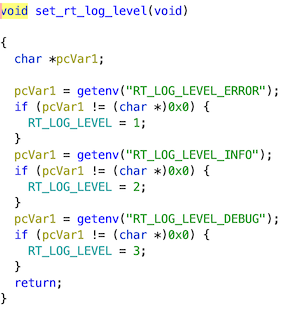
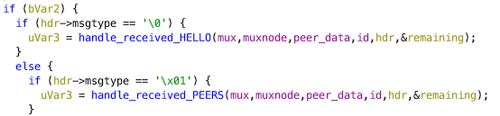
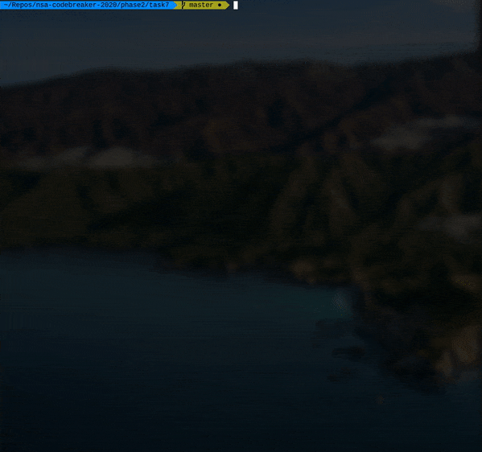
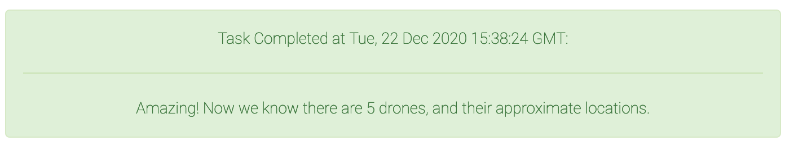

<div align="center">
    <a href="/phase1/task6"></a>
    <a href="/phase2/task8"></a>
</div>

<div align="center">

# Task 7 - Plan for Rescue

[](https://shields.io/)
[](https://shields.io/)
</div>

## Prompt

> With proof the journalist is alive and held inside the compound, the team will make a plan to infiltrate without being discovered. But, they see a surveillance drone and expect more are in the area. It is too risky without knowing how many there are and where they might be. To help the team avoid detection, we need you to enumerate all of the drones around the compound. Luckily we've made some discoveries at the safehouse which should help you. You can find the details in the attached README file. Get to work and give us the list of drone hostnames you discover. This will tell us how many to look for, and hopefully indicate where they might be.
>
> Downloads:
> * [Technical Notes (README.txt)](https://codebreaker.ltsnet.net/files/task6/README.txt)
> * [Wireguard VPN configuration to connect to drone network (Primary, UDP) (wg3.conf)](https://codebreaker.ltsnet.net/files/task6/wg3.conf)
> * [Wireguard VPN configuration to connect to drone network (Backup, TCP) (wg4.conf)](https://codebreaker.ltsnet.net/files/task6/wg4.conf)
> * [Drone network simulator (bundle.tar)](https://codebreaker.ltsnet.net/files/task6/bundle.tar)
> * [Connection script implemented from reverse engineering /opt/router/router (hello.py)](https://codebreaker.ltsnet.net/files/task6/hello.py)
>
> Enter the list of hostnames (case sensitive, one per line)
> ```
> ```

## Files

* [README.txt](/phase2/README.txt) - Provided technical notes
* [wg3.conf](/phase2/wg3.conf) - Provided UDP VPN configuration (Redacted)
* [wg4.conf](/phase2/wg4.conf) - Provided TCP VPN configuration (Redacted)
* [bundle.tar](/phase2/bundle.tar) - Provided drone network simulator
    - [bundle/](/phase2/bundle/) - Untarred drone network simulator
* [hello.py](/phase2/hello.py) - Provided Connection script 
* [solve.py](/phase2/task7/solve.py) - Modified `hello.py` that also sends PEERS request 
* [solution.txt](/phase2/task7/solution.txt) - Task solution

## Solution

Woah, they give us a lot of stuff in this task. Let's start wading through it all by reading `README.txt`. It has a few key points of information:

1. We have direct access to the drones through a VPN
2. We can simulate the drone network locally (could help with debugging!)
3. The router doesn't have any intentional bugs
4. A script (`hello.py`) is provided as starter code for communication with the router

Okay, let's see if we can get `hello.py` working on the simulation network and on the real drones. 

Running it without any arguments gives us the usage info:

```
$ python3 hello.py
usage: terminal [-h] [-v] [--host HOST] [--port PORT] {hello,send_packet} ...

positional arguments:
  {hello,send_packet}  sub-command help
    hello              hello help
    send_packet        send_packet help

optional arguments:
  -h, --help           show this help message and exit
  -v                   verbose
  --host HOST          hostname
  --port PORT          port
```

And in the code some comments help us see how to use it with the simulation:

```
1. Start up the test network with: docker-compose up
2. ./hello.py hello # this talks to test controller on port 9000
3. ./hello.py --port 9001 hello # this talks to the test drone on port 9000 which docker exposes on 9001
```

Navigating to the untarred `bundle/` directory, `docker-compose up --build` should work (*fingers crossed*) if you have Docker installed and running correctly:

```
$ docker-compose up --build
...
Recreating bundle_controller_1 ... done
Recreating bundle_drone_1      ... done
Attaching to bundle_controller_1, bundle_drone_1
drone_1       | 2021-01-18 18:26:08,063 INFO Set uid to user 0 succeeded
drone_1       | 2021-01-18 18:26:08,077 INFO supervisord started with pid 1
drone_1       | 2021-01-18 18:26:09,092 INFO spawned: 'flightmonitor' with pid 11
drone_1       | 2021-01-18 18:26:09,099 INFO spawned: 'power' with pid 13
drone_1       | 2021-01-18 18:26:09,104 INFO spawned: 'router' with pid 15
drone_1       | 2021-01-18 18:26:09,110 INFO spawned: 'updater' with pid 17
drone_1       | power: connected
drone_1       | packet has reply flag set, dont dispatch
drone_1       | updater: connected
drone_1       | packet has reply flag set, dont dispatch
drone_1       | 2021-01-18 18:26:10,945 INFO success: flightmonitor entered RUNNING state, process has stayed up for > than 1 seconds (startsecs)
drone_1       | 2021-01-18 18:26:10,946 INFO success: power entered RUNNING state, process has stayed up for > than 1 seconds (startsecs)
drone_1       | 2021-01-18 18:26:10,946 INFO success: router entered RUNNING state, process has stayed up for > than 1 seconds (startsecs)
drone_1       | 2021-01-18 18:26:10,948 INFO success: updater entered RUNNING state, process has stayed up for > than 1 seconds (startsecs)
```

Now running `hello.py` should work:

```
$ python3 hello.py hello
sending HELLO:
0027000000000000
017465726d696e61
6c00000000000000
0000000000000000
0000000000000000
00
RECVing HELLO...
0100000000000274
68655f636f6e7472
6f6c6c6572000000
0000000000000000
00000000000000
connected to: 0 2 b'the_controller'
```

Great! Looks like we're connected. Let's try the WireGuard VPN now to make sure it's working too. I loaded `wg3.conf` into my WireGuard app and guessed that the router would be at `10.129.130.1` from looking at the configuration files (AllowedIPs field) and assumed the port would also be 9000:

```
$ python3 hello.py --host 10.129.130.1 hello
sending HELLO:
0027000000000000
017465726d696e61
6c00000000000000
0000000000000000
0000000000000000
00
RECVing HELLO...
0100000000000263
6f6d706f756e645f
636f6e74726f6c6c
6572000000000000
00000000000000
connected to: 0 2 b'compound_controller'
```

Nice! Now we know how to communicate with the real controller and the simulated one! Since this is a reverse engineering task, we probably need to load up the router binary into Ghidra now. The layout of the files in the bundle is kind of weird, so here's the file structure:

```
$ tree
.
├── Dockerfile
├── docker-compose.yml
├── drone.tar.gz
├── etc
│   └── controller
├── flightmonitor.sh
├── opt
│   ├── flightmonitor -> /var/opt/updater/modules/flightmonitor/1.1
│   ├── netsvc -> /var/opt/updater/modules/netsvc/1.0
│   ├── power -> /var/opt/updater/modules/power/2.0
│   ├── router -> /var/opt/updater/modules/router/1.0
│   └── updater -> /var/opt/updater/modules/updater/1.0
├── supervisord.conf
└── var
    └── opt
        ├── flightmonitor
        ├── netsvc
        ├── power
        ├── router
        └── updater
            └── modules
                ├── flightmonitor
                │   ├── 1.0
                │   │   ├── flightmonitor
                │   │   ├── key.pub
                │   │   └── manifest
                │   └── 1.1
                │       ├── flightmonitor
                │       ├── key.pub
                │       ├── manifest
                │       └── manifest.sig
                ├── netsvc
                │   └── 1.0
                │       ├── key.pub
                │       ├── manifest
                │       └── netsvc
                ├── power
                │   ├── 1.0
                │   │   ├── key.pub
                │   │   ├── libpower.so
                │   │   └── manifest
                │   └── 2.0
                │       ├── key.pub
                │       ├── libpower.so
                │       ├── manifest
                │       └── manifest.sig
                ├── router
                │   └── 1.0
                │       ├── key.pub
                │       ├── manifest
                │       └── router
                └── updater
                    └── 1.0
                        ├── key.pub
                        ├── libupdater.so
                        └── manifest
``` 

The router binary we need to reverse is in `var/opt/updater/modules/router/1.0/router`. Loading it into Ghidra and digging around a bit, it's clear that we can enable some sort of logging. `set_rt_log_level()` is called in `main()`, and it uses environment variables to set the log level. This is something we can trigger just by changing the `docker-compose.yml` file. 

<div align="center">


</div>

By creating an environment variable called `RT_LOG_LEVEL_DEBUG` and setting it to 1, we can enable the maximum log level. However, after some experience, the `DEBUG` setting is too much information to go through for this task. `INFO` is enough to get what we need.

```
environment:
    - RT_LOG_LEVEL_INFO=1
```

Restarting with `docker-compose down` and `docker-compose up` does the trick! Now when we use `hello.py`, the router tells us:

```
controller_1  |      1 | 2021-01-23 16:09:55 | INFO_ | mux.c        |                       new_peer:121  | +PEER - id:4 fd:5 addr:0x9801
controller_1  |      1 | 2021-01-23 16:09:55 | INFO_ | handler.c    |          handle_received_HELLO:66   | FD  5 - +PEER (1): terminal
controller_1  |      1 | 2021-01-23 16:09:55 | INFO_ | mux.c        |                disconnect_peer:172  | -PEER - id:4 fd:5
```

`handle_received_HELLO()` seems interesting. Maybe we can send things other than HELLO messages? Jumping to where that function gets called in Ghidra, we can see that `handle_received_HELLO()` is called when the `msgtype` is 0, and `handle_received_PEERS()` is called when the `msgtype` is 1 in `handle_received_frame()`:

<div align="center">


</div>

Let's see if we can change the message type in `hello.py`. In `make_hello()`, the `msg` variable is set to 0. Just changing that to 1 and running it causes an error. And the controller in our simulation throws this error:

```
controller_1  |      1 | 2021-01-23 16:15:15 | INFO_ | mux.c        |                       new_peer:121  | +PEER - id:4 fd:5 addr:0x9801
controller_1  |      1 | 2021-01-23 16:15:15 | ERROR | handler.c    |          handle_received_frame:325  | FD  5 - handle_frame: non-HELLO before HELLO
controller_1  |      1 | 2021-01-23 16:15:15 | ERROR | mux.c        |                     mux_mux_in:499  | FD  5 - reader: READ_ERROR
controller_1  |      1 | 2021-01-23 16:15:15 | INFO_ | mux.c        |                disconnect_peer:172  | -PEER - id:4 fd:5
``` 

So, let's send a normal HELLO and *then* the PEERS request (see the code in [`solve.py`](/phase2/task7/solve.py)):

```
sending HELLO:
0027000000000000
017465726d696e61
6c00000000000000
0000000000000000
0000000000000000
00
RECVing HELLO...
0100000000000274
68655f636f6e7472
6f6c6c6572000000
0000000000000000
00000000000000
connected to: 0 2 b'the_controller'
sending PEERS:
0027000100000000
017465726d696e61
6c00000000000000
0000000000000000
0000000000000000
00
RECVing PEERS...
0101000098030374
68655f64726f6e65
0000000000000000
0000000000000000
00000000000000
b'\x01\x01\x00\x00\x98\x03\x03the_drone\x00\x00\x00\x00\x00\x00\x00\x00\x00\x00\x00\x00\x00\x00\x00\x00\x00\x00\x00\x00\x00\x00\x00'
```

`the_drone` is the name of the simulation drone connected to the router! That's exactly what we need. Adding some parsing, pretty-printing, and running it on the challenge network gives us this:

<div align="center">


</div>

These are the drone hostnames needed for this task, on to the next one!

<div align="center">


</div>

<div align="center">
    <a href="/phase1/task6"></a>
    <a href="/phase2/task8"></a>
</div>

---
