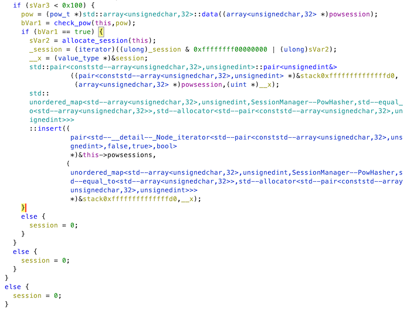
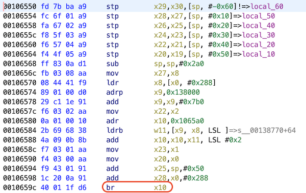
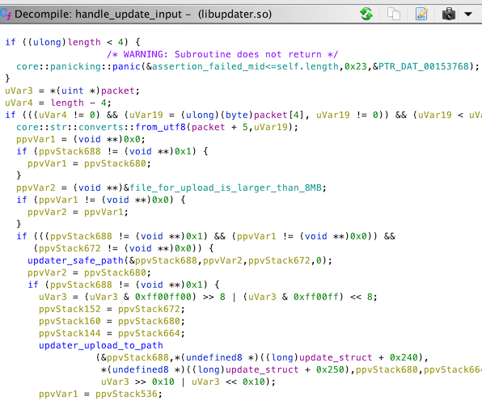

<div align="center">
    <a href="/phase2/task8"></a>
</div>

<div align="center">

# Task 9 - Rescue & Escape (Part 2)

[](https://shields.io/)
[](https://shields.io/)
</div>

## Prompt

> Now that you have a working power command, you need to make changes to the drones so the command will be accepted. This string in the power module gives us some hope: 'New Flight Monitor Available. Allowing forced power command'
> 
> Find a vulnerability in the updater module that allows you to update the flightmonitor to a new version. Exploit the vulnerability on all of the drones to prepare them. Then, send your power command validated in the previous task. Once all the drones are unresponsive, let us know by submitting the word 'READY' in the field below. We will confirm and then send in the team to rescue the hostage!
> 
> Additional Notes: This will require a better understanding of the netsvc module than you needed for the power command. The update process looks like it requires a long running 'session' and the netsvc may have some protection mechanisms to guard against bruteforce attempts which you will need to abide by.
> 
> Let us know when you are 'READY'
> ```
> ```

## Files

* [README.txt](/phase2/README.txt) - Provided technical notes
* [wg3.conf](/phase2/wg3.conf) - Provided UDP VPN configuration (Redacted)
* [wg4.conf](/phase2/wg4.conf) - Provided TCP VPN configuration (Redacted)
* [bundle.tar](/phase2/bundle.tar) - Provided drone network simulator
    - [bundle/](/phase2/bundle/) - Untarred drone network simulator
* [hello.py](/phase2/hello.py) - Provided Connection script 
* [solve.py](/phase2/task9/solve.py) - Updates all drones and then sends shutdown request
* [solution.txt](/phase2/task9/solution.txt) - Task solution

## Solution

### Creating A Session

We need to trick the drones into accepting a signed update without having the private signing key. One of the categories for this task is crypto, so we might be able to recover the key using the public key, manifest, and signature, but it could also be a problem with the signature verification itself. 

A good place to start is by sending DATA/OPEN messages to the updater module, just like we did with the power module in the last task. Unfortunately, sending a DATA message doesn't seem to do anything. Sending an OPEN message returns a few values, and this message in the docker logs:

```
updater: recved OPEN
updater: OPEN has new session request
updater: OPEN has session=0
```

Sending an OPEN and then a DATA request doesn't seem to do anything useful though. Time to jump back into Ghidra! Session management happens in the `netsvc` binary and there's some stuff about proof-of-work as mentioned last task, maybe that will come into play here. `dispatch_packet()` calls `new_session()`, which returns 0 as by default if a bunch of conditions (including `check_pow()`) fail. Hmmm, I guess we don't want session 0. 

<div align="center">


</div>

Rather than figuring this all out statically, it sure would be nice if we could walk through `check_pow()` in GDB. It turns out that we can! It's not as simple as `apt install gdb`, but it is fairly easy:

1. Expose a port to `drone` for the GDB stub in `docker-compose.yml`:
```
ports:
    - 1234:1234
```
2. Drop into a shell on the drone: 
```
docker exec -it bundle_drone_1 sh
```
3. You can't run GDB directly in QEMU, but you can use the `-g` flag to listen for a remote GDB connection:
```
/usr/bin/qemu-aarch64-static -g 1234 /opt/netsvc/netsvc 127.0.0.1 9000 updater /opt/updater/libupdater.so api 300
```
4. From the host machine, use `gdb-multiarch` to connect to the stub and configure it
```
$ gdb-multiarch bundle/var/opt/updater/modules/netsvc/1.0/netsvc
(gdb) target remote 127.0.0.1:1234
(gdb) b check_pow
(gdb) c
```

This registers a new `updater` module with the drone, so whenever we send an OPEN request to the new module it will trigger our breakpoint at `check_pow()`. Additionally, once we get to reversing the updater and power modules themselves, the shared libraries can be loaded in GDB on the host with `add-symbol-file libupdater.so <address of .text section>` and a breakpoint can be set with `b api`.

As a result of reversing `check_pow()`, we can find out that the proof-of-work bytes are as follows:

| Name | Size (Bytes) | Example of Expected Value | Description |
| ---- | ------------ | ------------------------- | ----------- |
| Version | 1 | 1 | Guessing this is the version of the proof-of-work algorithm |
| Bits | 1 | 20 | The pow difficulty, how many bits need to be zero in the resulting hash |
| Salt Name | 2 | 13 | This is the PID of the module process |
| Timestamp | 4 | 1611855054 | Timestamp to ensure freshness |
| Salt High | 8 | 200 | Unknown and irrelevant |
| Salt Low | 8 | 2367700610979040004 (unsigned) | Unknown and irrelevant |
| Counter | 8 | 2532616 | This is the value we have to change until a hash is found that matches the requirements |

The version, bit length, PID, and salts are all checked to make sure they match with what `netsvc` expects. How do we get these values on the real drone network? Well, upon receiving a bad proof-of-work, the drone will reply with those values! So we can send 32 bytes of whatever in the OPEN and then parse the response to get the PID and salt values.

The way `check_pow()` works is that the 32-byte proof-of-work message is hashed using sha256 and the result must have zeroes in the leftmost 20 bits. The freshness requirement requires us to iterate the counter until we find a hash that makes those bits zero everytime we want to OPEN a session. Now we know how it works, let's see what a successful proof-of-work gets us!

```
RECVing good pow OPEN Response from b'the_drone1'...
8105000e01666666
6704980100019804
134a011411006013
2414640000000000
00008cd522954808
da96297e06000000
00001a4261642075
7064617465207265
71756573743a2066
61696c6564
Content: b'\x1aBad update request: failed'
```

Nice! Kind of. Now we have to reverse the update process 😬. This is where dynamic debugging really comes in handy. We can set breakpoints in the update to see exactly what goes wrong and where. Maximizing logging helps too. 

### Updating `flightmonitor`

Really all I did to reverse the update process was set breakpoints/follow the execution path, look at Ghidra to figure out what values to pass, and read the logs. I didn't do any magical crypto stuff to get this to work, I just noticed that passing blank values seemed to continue moving the state forward even though signature verification fails. So I'm not gonna get into the reversing details. One tricky thing I will say about the `libupdater.so` binary is that in `updater::pkt_entry()`, after the OPEN succeeds in starting the update, DATA messages are handled in `updater::handle_update_input()`:

<div align="center">


</div>

The `br x10` is where the function stops because Ghidra doesn't know where that jump leads. In GDB you can set a breakpoint at this function and record how the destination changes as the update state changes, then mark those destinations as functions in Ghidra to get a full function and decompilation:

<div align="center">


</div>

Using this trick and slowly working my way through the update process, here were my results:

| Request Type | Contents | Description |
| ------------ | -------- | ----------- |
| OPEN         | `pow + len(module name) + module name + len(from version) + from version + len(to version) + to version` | This basically says which module we're updating and the source/destination version numbers |
| DATA | `pow + manifest.sig` | Presumably the signature of `manifest`, provided in `bundle` | 
| DATA | `pow + size of manifest + manifest` | The manifest contains the sha256 hashes of the files included in this update and their filenames (e.g., libpower.so and key.pub), also provided in `bundle`, doesn't need to be accurate |
| DATA | `pow` | This tricks the update process into continuing, even though `manifest.sig` is incorrect |
| DATA | `pow + size of module + len(module name) + module name + file contents` | These are the update files as detailed in the manifest. I'm starting with `flightmonitor` |
| DATA | `pow` | Again, trick into skipping validation |
| DATA | `pow + size of key.pub + len('key.pub') + 'key.pub' + key.pub` | Same thing as the last request, with the next file. `key.pub` in this case | 
| DATA | `pow` | Again, trick into skipping validation |
| DATA | `pow` | This should trigger an error that says: `Error Updating: Extra data after complete update`, lets us know if the update completed successfully | 
| CLOSE | `pow` | I wasn't raised in a barn |

Once the OPEN request succeeds, the response will be a null byte and we can move on to the DATA. Some errors will occur: `Error Updating: bad signature`. Don't worry, the blanks make it work. Once every frame from the table is sent, the shutdown frame from the last task should work:

```
Error spawning command
```

This isn't very encouraging, but in the logs we can see that it worked!

```
power: recved DATA
Running flightmonitor is not a shell script from the configured directory.  Must not be up to date.
New Flight Monitor Available.  Allowing forced power command
power: command: shutdown
```

It seems to be working, now we can try this on the real network and finally be done!

<div align="center">


</div>

We did it! The challenge is complete and the journalist has been saved. 

<div align="center">


</div>

<div align="center">
    <a href="/phase2/task8"></a>
</div>

---

## References

* [GDB Usage - QEMU](https://qemu.readthedocs.io/en/latest/system/gdb.html)
* [QEMU GDB Stub - Reverse Engineering Stack Exchange](https://reverseengineering.stackexchange.com/a/8917)
